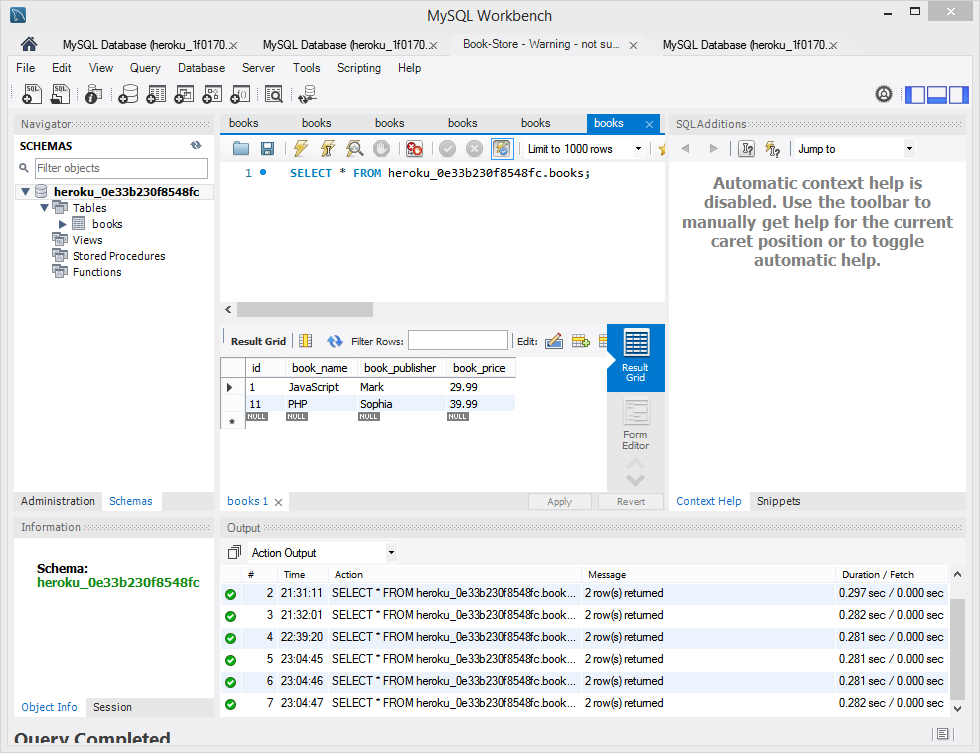

# Book-Store

* PHP Basic Project With MySql
* This project created by Composer with Doctrine DBAL package
* Using DBAL to connect the MySql Database
* Input data to the MySql
* Display the data on the page

## Link to Live Environment

https://phptest-1-1.herokuapp.com/

## How to use Book Store
* Input the Book Name, Publisher and Price
* Click the Add button, the data will be stored in the mysql database
* Click the Read Button, the app will display all the data

## The Demo

## MySql workbench

## Technologies Used

* PHP 
* Composer
* MySql database
* PhpMyAdmin
* XAMMP
* Heroku
* ClearDB
* Bootstrip

## Future Features

* Add EDIT and DELETE button
* Improve the ID increment issues from ClearDB
* Fix the phpmyadmin issues on MAC
